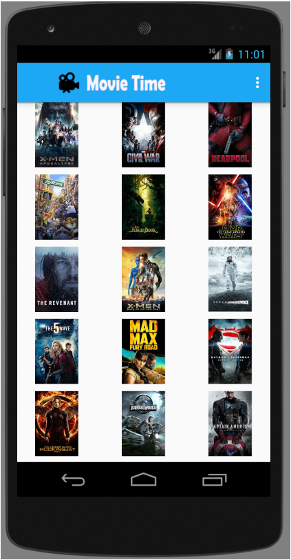
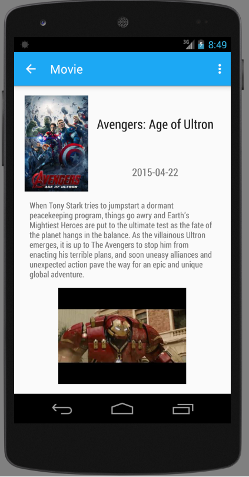
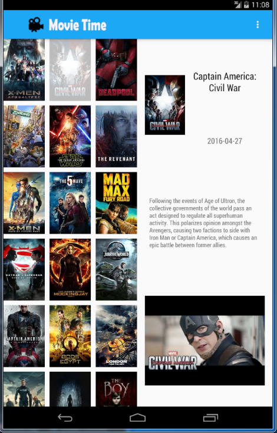

# Movie Time
Movie Time is an Android application which keeps the user up to date with the latest
popular movies.

A debug version of the app is available here: [app-debug.apk](app-debug.apk).

It is intended for demonstration of Android application fundamentals.
It includes: Activities, Fragments, Service, Content Prvoider, SQLite, Adapters, Loaders, REST Api interaction,
  JSON parsing, Screen rotation and support for multiple screen sizes.

Note: For proper application running, a valid The Movie Database API key is required: https://www.themoviedb.org/faq/api
It should be configured in the build.gradle file in the app direcory. 

    buildTypes.each {
        it.buildConfigField 'String', 'THE_MOVIE_DB_API_KEY', "\"xxxxxxxxxxxxxxxxxx\""
    }

The launcher icon is borrowed from: https://icons8.com

Below are some screenshots for Nexus 5 and Nexus 7.

